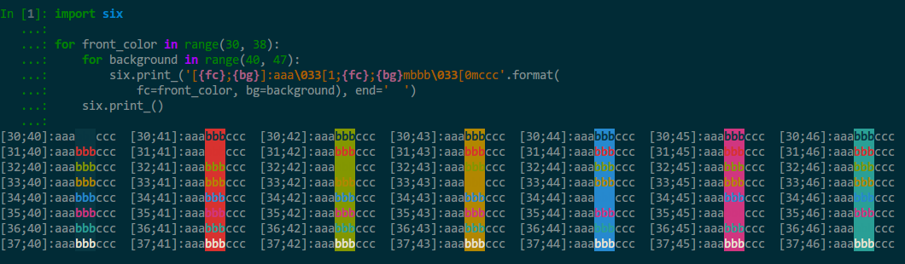

# highlight.py

## 需求

如果想在终端上输出字符时调整字体格式、颜色和背景色，需要借助`\033`转义字符。

例如linux上的echo命令，python中的print语句。

## 知识点

语法：

`\033[显示方式;字体颜色;背景色m被格式化的字符串`

说明：

1. 显示方式、字体颜色、背景色没有先后顺序
2. 通常在字符串后面加`\033[0m`关闭所有属性
3. 数字和显示关系如下表
    
    | Number | Style |
    | - | -- |
    | 0 | 关闭所有属性 |
    | 1 | 高亮   |
    | 4 | 下划线 |
    | 5 | 闪烁   |
    | 7 | 反显   |
    | 8 | 消隐   |

4. 数字和颜色的关系如下表

    | Color   | Foreground | Background |
    | ------- | -- | -- |
    | black   | 30 | 40 |
    | red     | 31 | 41 |
    | green   | 32 | 42 |
    | yellow  | 33 | 43 |
    | blue    | 34 | 44 |
    | magenta | 35 | 45 |
    | cyan    | 36 | 46 |
    | white   | 37 | 47 |

## 效果图

```python
import six

for front_color in range(30, 38):
    for background in range(40, 47):
        six.print_('[{fc};{bg}]:aaa\033[1;{fc};{bg}mbbb\033[0mccc'.format(
            fc=front_color, bg=background), end='  ')
    six.print_()
```

颜色效果会因终端配色而异：



## 实现

```python
#!/usr/bin/env python
# -*- coding: utf-8 -*-
# filename: highlight.py

import re
import sys
import signal


def exit_handler(sig, frame):
    exit(0)


def highlight(context, keywords):
    if not isinstance(context, basestring) or not keywords:
        return context

    for word in keywords:
        # 如果高亮的是error，则将字体颜色改成红色，否则蓝字黄底
        style = '\033[31m' if word.lower() == 'error' else '\033[1;34;43m'
        hl_word = '{}{}\033[0m'.format(style, word)
        
        # 忽略大小写
        context = re.sub(word, hl_word, context, flags=re.IGNORECASE)

    return context


if __name__ == "__main__":

    signal.signal(signal.SIGTERM, exit_handler)
    signal.signal(signal.SIGINT, exit_handler)

    argvs = sys.argv[1:]

    while True:
        line = sys.stdin.readline()
        if not line:
            break
        sys.stdout.write(highlight(line, argvs))

    # test: echo 'aatestError' | ./highlight.py aa error
```

## 使用

```bash
$ chmod +x highlight.py
$ cp highlight.py /usr/local/bin/highlight
$ echo 'aatestError' | highlight aa error
aatesterror
$ tail -f log | highlight ERROR
......
```

